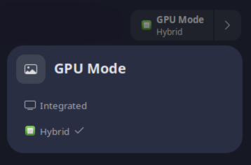

# GPU-Supergfxctl-Switch

GPU Profile switcher Gnome-Shell-Extension for ASUS laptops using Supergfxctl

Currently tested on Arch / Gnome 46 / X11

Supergfxctl v5.2.1-2

asusctl v6.0.9.r0.gfaca084-1



## Use this only if you

1. Have a laptop with Optimus Mux Switch and want to switch between iGPU and dGPU modes
2. want to monitor the dGPU status

## Dependencies

- [asusctl](https://gitlab.com/asus-linux/asusctl)
- [supergfxctl](https://gitlab.com/asus-linux/supergfxctl)

## Installation

### Gnome Extensions Store

- Install all the dependencies
- Download the extension from the Store

 [](https://extensions.gnome.org/extension/7018/gpu-supergfxctl-switch/)


### Manual

- clone this repo

    ```bash
    cp -r GPU-Switcher-Supergfxctl ~/.local/share/gnome-extensions/gpu-switcher-supergfxctl@chikobara.github.io
    ```
